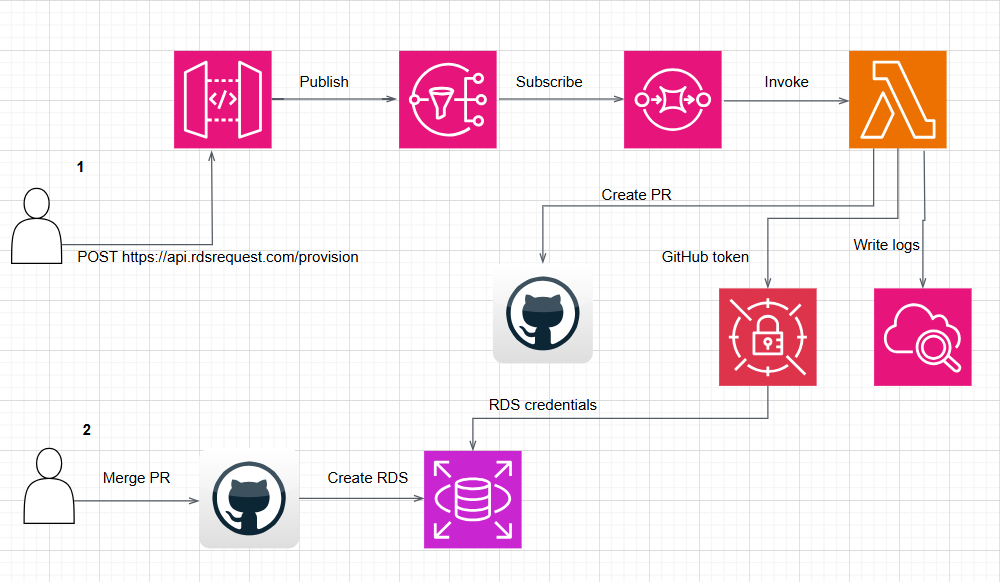

# Serverless RDS Cluster Automation

This project provides an automated solution for provisioning Amazon RDS clusters on demand using AWS serverless architecture and Infrastructure as Code (IaC). Developers can request a RDS cluster through an API, which triggers an automated pipeline to create the infrastructure using Terraform.

## Overview
The developer sends a POST API request to https://api.rdsrequest.com/provision with the following data:
- Database name
- Database engine (MySQL, PostgreSQL)
- Database environment (Dev/Prod)
For example:
```json
{
  "databaseName": "mydatabase",
  "databaseEngine": "MySQL",
  "environment": "Dev"
}
```
What happens next?

### Process Flow

1. The API Gateway receives the request and publishes the request body to an SNS topic.
2. SNS forwards the request to an SQS queue for reliable processing.
3. When SQS receives a new message, it triggers a Lambda function.
4. The Lambda function (python) generates Terraform configuration and creates a pull request on GitHub to provision the RDS cluster.
5. Once the PR is merged, the CircleCI pipeline is triggered to apply the Terraform and create the RDS cluster.

### Architecture



## Deployment and Automation Instructions

### Prerequisites
1. Create two secrets in AWS Secrets Manager: 
    - rds-credentials: Store the RDS username and password in JSON format: {"username": "your_username", "password": "your_password"}. 
    - github-secret: Store your GitHub personal access token: {"github-token": "your_token"}.

2. Configure the following environment variables in your CircleCI project settings:
    - AWS_ACCESS_KEY_ID: Your AWS access key ID.
    - AWS_SECRET_ACCESS_KEY: Your AWS secret access key.
    - AWS_REGION: The AWS region where you want to deploy the resources (e.g., us-east-1).

When merging to main the AWS SAM is deployed with the serverless architecture (API Gateway, SNS, SQS, 
and Lambda)

That's it! Now you can provide RDS clusters for developers in automated way!!